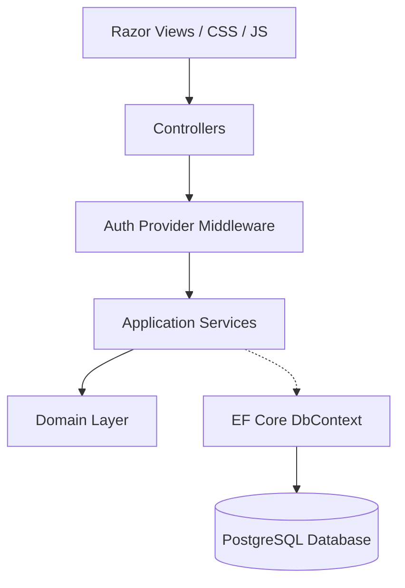

# Architecture Specifications

The system is built on **Clean Architecture** patterns to enforce separation of concerns, decoupling, and strict testability.

## Layer Structure Overview
- **BusinessManagement.Domain**: Core models, value objects, domain rules, and repository contracts. No external dependency references.
- **BusinessManagement.Application**: Use cases, service logic, mappings, validator schemas, and service contracts.
- **BusinessManagement.Persistence**: EF Core DbContext, Repositories implementations, Unit of Work, Outbox patterns, and Database Migrations.
- **BusinessManagement.Infrastructure**: Mail sending integrations, external booking aggregators, and system logging services.
- **BusinessManagement.Shared**: Encryption helpers (AES-GCM), ClamAV antivirus TCP scanning, and TOTP helpers.
- **BusinessManagement.Web**: Presentational MVC controllers, security middlewares, localization setups, and Razor views.

## Component Flow Diagram

