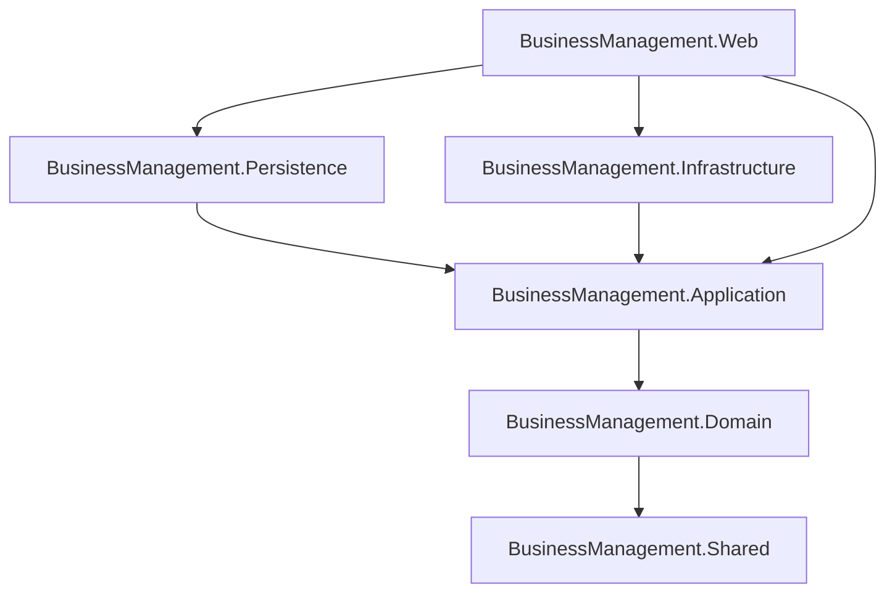

# Architecture Specifications

## Bounded Contexts & Clean Architecture
The Hajj & Umrah ERP system is modeled using Domain-Driven Design (DDD) principles and partitioned into distinct Clean Architecture layers to maintain a separation of concerns.

### Clean Architecture Layers
1. **Domain Layer**: Contains database entities, aggregates, enums, value objects, and repository contracts. No third-party dependencies are referenced.
2. **Application Layer**: Contains business service contracts (interfaces), implementations, DTO models, mappings, and validation contracts.
3. **Persistence Layer**: Implements database interactions using Entity Framework Core, including repositories, Migrations, seed initializations, and Outbox dispatch.
4. **Infrastructure Layer**: Implements third-party service adapters (e.g., SMTP, external APIs).
5. **Shared Layer**: Houses cross-cutting helper services like Pbkdf2PasswordHasher, TotpHelper, ClamAV socket scanner socket, and AES-GCM encryption helpers.
6. **Web Presentation Layer**: Built with ASP.NET Core MVC Razor Views, hosting web controllers, security middlewares, validation attributes, and localized resources.

## Dependency Injection Lifecycles
- **Transient**: Used for lightweight services (hasher, helpers).
- **Scoped**: Used for DbContext, Repositories, Unit of Work, and Service implementations to secure transaction boundaries.
- **Singleton**: Used for cache-repositories and Dynamic Permission handlers.
