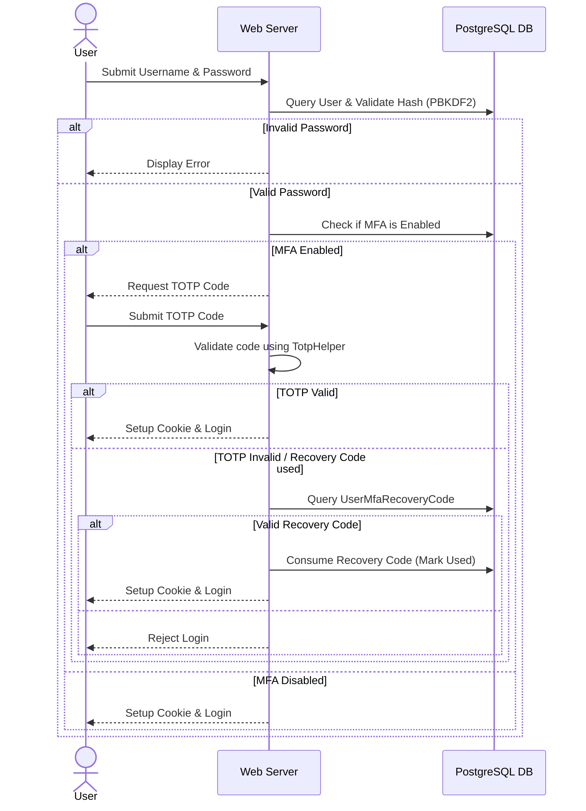

# Authentication & MFA Architecture

The authentication system is built using ASP.NET Core Cookie Authentication and enhanced with Multi-Factor Authentication (MFA).

## Session Security Configuration
- **SameSite**: Enforced to `Strict` to prevent Cross-Site Request Forgery (CSRF).
- **HttpOnly**: Cookie is set as `HttpOnly = true` to prevent accessibility from client-side JavaScript.
- **SecurePolicy**: Set to `SameAsRequest` or `Always` to enforce SSL encryption in transmission.

## MFA Login Flow Chart

