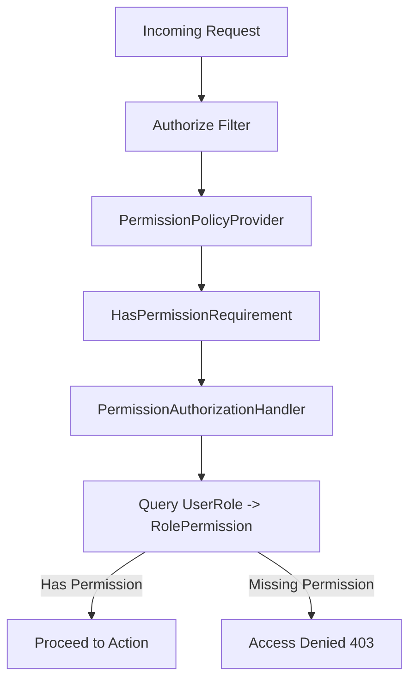

# Role-Based Access Control (RBAC)

The system implements Role-Based Access Control (RBAC) utilizing dynamic permissions mapped via a custom `PermissionPolicyProvider` filter.

## User Roles
1. **Admin**: Full database management, user provisioning, financial audit ledger clearing, and full business excel uploading capabilities.
2. **Manager**: Full operational access (CRM, bookings, approvals), viewing reports, and cashbox monitoring.
3. **Operator**: Access to passenger records, creating bookings, and uploading files. No access to financial ledger configuration.
4. **Partner**: Access restricted to bookings and metrics assigned directly to their username (attribution check).
5. **Accountant**: Full access to double-entry accounting ledgers, journal entries, and safe logs.

## Dynamic Permission Enforcement Flow

