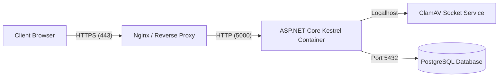

# DevOps & Deployment Guide

## Production Environment Setup
The ERP is optimized to deploy in Docker containers behind a reverse proxy (Nginx or IIS).



## Recommended Docker Compose configuration
```yaml
version: '3.8'

services:
  web:
    image: hajj-umrah-erp:latest
    build:
      context: .
      dockerfile: src/BusinessManagement.Web/Dockerfile
    ports:
      - "5000:8080"
    environment:
      - ASPNETCORE_ENVIRONMENT=Production
      - ConnectionStrings__DefaultConnection=Host=db;Port=5432;Database=travel_prod_db;Username=postgres;Password=prodpassword
      - ClamAV__Host=clamav
      - ClamAV__Port=3310
    depends_on:
      - db
      - clamav

  db:
    image: postgres:16-alpine
    environment:
      - POSTGRES_DB=travel_prod_db
      - POSTGRES_PASSWORD=prodpassword
    volumes:
      - pgdata:/var/lib/postgresql/data

  clamav:
    image: clamav/clamav:latest
    ports:
      - "3310:3310"

volumes:
  pgdata:
```
